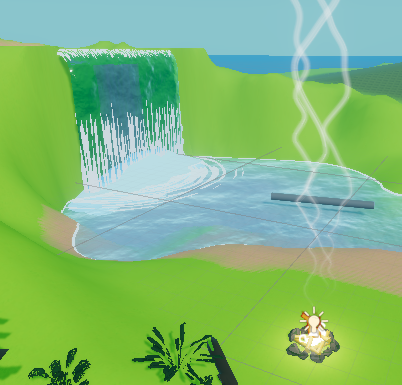
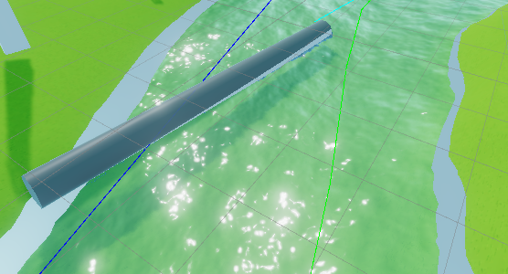
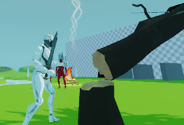
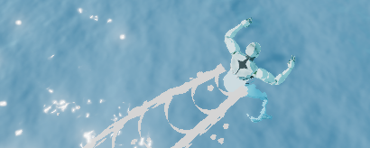
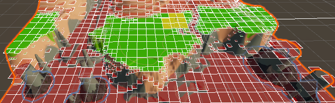

# Armere

All of my hobby projects in one big bundle.

Communications between different projects (mechanics) are structured through event driven dependency injection, 
using Unity's scriptable objects acting as event delegates (Mechanics/ScriptableObjects/EventChannels). Examples of these
are connecting the enemy death event to spawning interact-able items, or connecting the player's sword swing to destroying 
blades of grass.

# Gameplay

The `playercontroller` system is state driven and has a lot of functionality, including running Yarn dialogue 
during any "interactions" triggered, and full movement including swimming and climbing (on specific vine walls)
The player is attached to it's inventory and quest book for item and goal usage.

The NPCs follow routines based on the time of day, and each store there own inventory locally, allowing for any
NPC to engage in trade if the dialogue command is triggered.

The save load system and game constructor are used to save game state directly into binary, although eventually 
this will use the messagepack format.

Enemies and Animals use a similar state based system as the `playercontroller` to perform (at the moment very basic)
activities.

# Physics

## Buoyancy

The buoyancy system uses the voxel approach to sample discrete cubes within a physics object for how much water they displace and 
so how much force and torque should be enacted on the object. This is done in parallel, also using Unity Burst allowing for very fast execution

## Trees

Chopping down trees creates dynamic tree meshes as the trunks have cuts marked into them and are eventually felled.
Chops reveal the rings inside the tree by using a separate texture and material for tris created inside the trunk. 
This is also done in parallel using burst resulting in very quick performance

# VFX
## Water
Swimming in water creates a particle effect that leaves ripples behind the player. Any items entering or exiting water create their
own splashes and ripples

## Grass 

Using draw instanced indirect functionality, I have been able to (after many attempts) create a system to place blades of grass on height mapped terrain, using local terrain data such as splatmaps to inform how the grass should be created. 

A chunk system is used stored as a quad-tree to
enable quick loading and unloading of grass blades, represented as blocks of gpu memory.

 Grass blades can also be destroyed using compute shaders, for example the destroy grass in bounds event channel will mark every blade of grass in the bounds as dead, then while rendering, a prefix parallel sum pass is performed to pack all living blades into a separate buffer for rendering.

